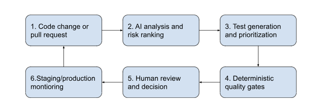
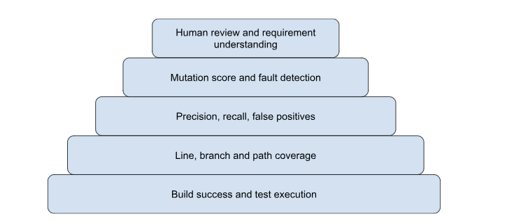
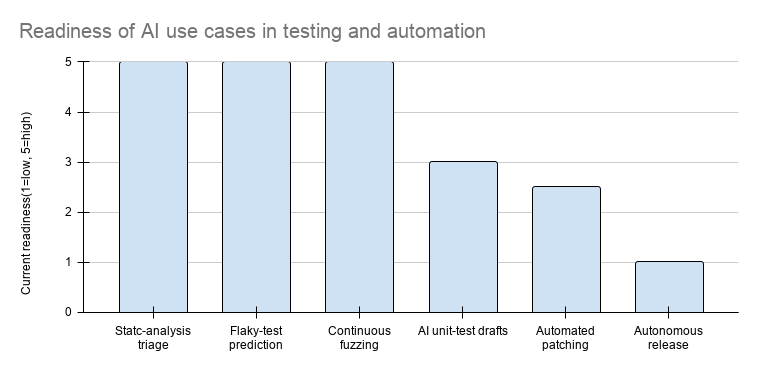
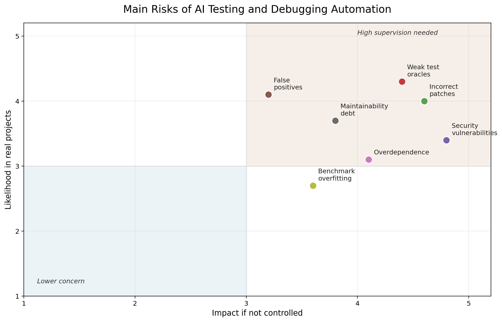

# AI Testing, Debugging, and Automation in Software Engineering

**Student:** Eda Hoxha  
**Course:** SWE 101 — Introduction to Software Engineering  
**Department:** Department of Computer Engineering, Epoka University  
**Instructor:** Dr. Eng. Halit Vural  
**Date:** May 27, 2026

\---

## 1\. Introduction

Artificial Intelligence is transforming many aspects of software engineering, including testing, debugging, automation, and software maintenance. In traditional software development, developers usually wrote tests manually, used debugging tools, and reviewed the code themselves to identify mistakes. Today, AI-supported technologies can help create test cases, detect potential bugs, suggest fixes, and support automation within development workflows.

However, AI does not eliminate the need for software engineers and programmers. Instead, it changes their role. Engineers must understand how AI tools work, evaluate their outputs, and determine whether generated tests or fixes are reliable and trustworthy. This is crucial because AI can make helpful recommendations, but it can also generate incomplete tests, incorrect fixes, or insecure code. Therefore, future software engineers must combine AI tools with strong testing knowledge, critical thinking, and human supervision.

The main argument of this research is that AI is valuable in software testing, debugging, and automation, but only when it is used carefully. AI should not be considered a fully independent decision-maker. It should be treated as a support tool that helps engineers work faster while humans remain responsible for correctness, security, and quality.

\---

### Human-in-the-Loop AI Testing and Automation Workflow

AI proposes and prioritizes possible solutions, deterministic tools verify them, and humans approve high-impact decisions.

\---

## 2\. Scope of the Topic

This topic includes several related areas. The table below summarizes how AI supports each part of testing, debugging, and automation.

|Area|Typical AI Support|Main Benefit|Main Limitation|
|-|-|-|-|
|Testing|Generates unit tests, regression tests, and edge-case suggestions|Speeds up test creation|May produce shallow tests|
|Bug detection|Ranks risky code and identifies possible vulnerabilities|Focuses developer attention|Can create false positives|
|Debugging|Suggests causes and possible fixes|Reduces investigation time|Patch may be plausible but wrong|
|CI/CD automation|Work in progress|Work in progress|Work in progress|
|Maintenance|Work in progress|Work in progress|Work in progress|

\---

## 3\. AI in Software Testing

AI can support software testing by generating unit tests, proposing missing test cases, improving regression testing, and helping engineers detect weak areas in the code. One common example is EvoSuite, a tool that automatically generates unit tests for object-oriented Java programs. EvoSuite uses search-based techniques to create test suites that aim to increase code coverage (Fraser \& Arcuri, 2011). Later research showed that automated unit test generation can be useful in large-scale settings, although the quality of the tests depends on the complexity of the code and the quality of the test oracle (Fraser \& Arcuri, 2014).

The important point is that automated test generation is not valuable only because it creates many tests. Its value depends on whether the tests check meaningful behavior. A tool may generate a very large number of tests and increase code coverage, but this does not automatically mean that the software is well tested. A weak test may execute code without actually checking whether the output is correct. Therefore, software engineers should not evaluate AI testing only by the number of generated tests or by coverage percentages.

In recent years, large language models have also been studied for test creation. These models can read source code and generate tests in a way that resembles tests written by humans. TESTEVAL evaluates large language models for test case generation and shows that LLMs can generate useful tests, but they still struggle with more difficult testing goals such as branch coverage and path coverage (Wang et al., 2024).

This finding is significant because branch and path coverage often require a deeper understanding of program logic. Important edge cases could be missed if the AI model generates only basic tests. Many serious problems in real software systems can appear in unusual situations, such as rare user inputs, unexpected states, or combinations of conditions. This means that although AI can assist with testing, human testers and developers must still carefully consider system requirements and edge cases.

Another important method is mutation testing. Mutation testing checks whether a test suite can detect small artificial errors. If the tests cannot detect these changes, the test suite may be weak. Research on LLM-based test generation with mutation testing shows that mutation feedback can improve the quality of generated tests because it helps identify weaknesses that simple code coverage may not reveal (Moradi Dakhel et al., 2023).

This gives a stronger way to evaluate AI-generated tests. Instead of asking only “Did the test run?” or “Did coverage increase?”, mutation testing asks: “Can this test actually detect faults?” This difference is very important because the real purpose of testing is not just to execute code, but to reveal problems before users experience them.

\---

## 4\. AI in Bug Detection

AI can also help detect bugs and identify vulnerabilities. Static analysis tools have traditionally been used to inspect source code without running it. AI-based methods go further by learning patterns from large amounts of data, including source code and previous bugs. For example, CodeBERT is a pre-trained model for programming languages and natural language. It can support tasks such as code understanding, code search, and defect-related analysis (Feng et al., 2020).

Another example is Devign, a deep learning model designed to identify software vulnerabilities by learning program semantics from source code. Devign uses graph neural networks to understand relationships inside code and identify vulnerable patterns (Zhou et al., 2019). This type of AI-based bug detection helps developers inspect large codebases more efficiently.

The main benefit of AI bug detection is speed. AI can analyze many files and highlight risky areas faster than a human developer could manually. It can also help identify patterns that developers may overlook during the review process. This is especially useful in large projects, where manually reviewing every line of code would be very difficult and time-consuming.

However, the biggest drawback is that bug detection and bug understanding are not the same thing. A model can predict that a piece of code is risky, but it may not fully understand the business logic or the system’s intended behavior. This can lead to false positives, where the tool reports a problem even though the code is actually correct. If developers receive too many false positives, they may stop trusting the tool. This creates a practical problem: a tool that finds real bugs but also produces too many unnecessary warnings may still reduce productivity.

AI tools may also miss faults if the project is very different from the data used to train the model. For example, a model trained mainly on open-source projects may not perform as well on private company software with different architecture or coding standards. This means AI bug detection should be used as a support system, not as final proof that code is correct or incorrect.

The analytical conclusion is that AI bug detection is most helpful when it prioritizes human attention. It can guide programmers to sections that need closer inspection, but it should not replace code reviews. The final decision should remain in the hands of engineers.

\---

### Evaluation Layers for AI-Generated Tests

The stronger the claim of reliability, the stronger the evaluation evidence should be.

\---

## 5\. AI in Debugging and Automated Repair

AI is also used in debugging and automated program repair. Debugging usually means finding the cause of a bug and fixing it. AI can help by suggesting the possible location of the error, explaining it, or proposing a fix.

One example is Getafix, a system that learns from previous human bug fixes and suggests similar fixes for new bugs (Bader et al., 2019). This is useful because many software problems follow repeated patterns. Developers often fix null pointer errors, missing checks, incorrect conditions, or resource management issues in similar ways. If artificial intelligence can learn these patterns, it can propose fixes more quickly.

The advantage of systems like Getafix is that they focus on bug patterns that occur repeatedly. This makes automation more realistic. AI is more trustworthy when the task is narrow, common, and supported by many previous examples. This suggests that, at the moment, AI repair is more suitable for repetitive bug categories than for complex architectural problems.

However, automated repair carries a risk. Even if a generated patch passes the current tests, it may still be logically incorrect. Research on automatic repair using the Defects4J dataset showed that some generated patches were only “plausible,” meaning they passed the test suite but were not necessarily correct according to the real program requirements (Martinez et al., 2017).

This is one of the most important findings in AI debugging. Passing tests does not always mean the problem is truly fixed. If the test suite is weak or incomplete, an incorrect patch may still pass. This creates a false sense of correctness. In other words, AI may produce a solution that looks valid from the outside but does not actually solve the deeper problem.

Therefore, developers must carefully check AI-generated fixes. Human understanding is needed to verify whether the fix matches the system design, user requirements, security rules, and maintainability goals. AI can suggest a possible repair, but humans must decide whether the repair is actually acceptable.

\---

## 6\. AI in CI/CD Automation and Software Maintenance

CI/CD pipelines are used to automate the process of building, testing, and deploying software. AI can support these pipelines by prioritizing tests, detecting risky commits, and recommending possible repairs before code is merged.

For example, when a developer changes the code, AI may help determine which tests should run first. This is useful in very large projects, where running all tests after every small change can take too much time. AI can also support failure analysis by grouping similar errors or identifying whether a failure was caused by a real bug, an environment problem, or an unstable test.

The analytical value of AI in CI/CD is that it can reduce waiting time and help teams focus on the most important tasks. In modern software projects, fast feedback is essential. If developers wait too long for test results, development slows down. AI can improve this process by highlighting possible failure causes or prioritizing tests.

Another area where AI can support software engineering is maintenance. Maintenance includes fixing bugs after release, updating code, and improving software quality over time. Continuous fuzzing is one example of automated maintenance support. Fuzzing tools create many random or semi-random inputs to identify failures and vulnerabilities. Research on OSS-Fuzz bugs shows that continuous fuzzing can help discover real defects in open-source software projects (Ding \& Le Goues, 2021).

The importance of fuzzing is that it can find unexpected failures that normal human-written tests may miss. Developers often test the expected behavior of a program, while fuzzing explores unusual inputs and edge cases. This makes it valuable for security and reliability testing.

However, CI/CD automation must be handled carefully. If AI automatically approves code, skips important tests, or deploys changes without proper verification, serious problems may appear in production. For this reason, AI should mainly support recommendations, while final decisions about merging, releasing, or accepting fixes should still be handled by human reviews.

\---

## 7\. Reliability of AI-Generated Testing

The reliability of AI-generated testing depends on the quality of the AI model, the quality of the code, and how the generated tests are evaluated. While code coverage is a popular evaluation measure, it is usually not enough. An evaluation can run multiple lines of code without verifying the program's correctness.

Research on automated unit test generation shows that generated tests can improve coverage, but they may still fail to capture the real purpose of the program (Fraser \& Arcuri, 2014). Similarly, recent work on LLM-generated tests shows that models can produce useful test cases, but they still struggle with complex testing goals and may miss important edge cases (Wang et al., 2024). 

As a result, reliability should be evaluated using several criteria. Code coverage can show if certain parts of the program were executed, but it cannot guarantee that the tests are valuable. Since it determines whether tests can identify man-made problems, mutation testing offers a more accurate assessment. According to Moradi Dakhel et al. (2023), generated tests may not be strong enough to detect minor code changes and, as a result, may not be able to catch genuine problems.

The primary conclusion is that tests which are created by AI, should be treated only as drafts. While they indeed save time and may give developers a starting point, they must still check and review them. Good testing requires an understanding of business logic, user behavior, requirements and edge cases. These are fields where human judgement is still necessary.

\---

## 8\. Risks of Automation

One major risk of AI automation is overdependence. If developers accept AI-generated tests or fixes without understanding them, they might lose important testing and debugging skills. This is dangerous because software engineers are still responsible for the software they deliver.

In addition, another risk is the incorrect output because even though AI tools are able to generate tests that look correct, sometimes they do not check the right behavior. They can also generate fixes that pass the current test suite but do not solve the real problem(Martinez et al., 2017). This can be really dangerous given that the output may look professional even when it is wrong.

A third risk is security. AI-generated code may contain vulnerabilities if it is not reviewed correctly and carefully by the professionals. Research on GitHub Copilot showed that AI-generated code can include insecure patterns, especially in security-sensitive scenarios (Pearce et al., 2022). In other words, these professionals should check AI suggestions and proposals for security problems before they are used in real life systems.

Last but not least, the fourth risk is maintainability. In reality AI-generated tests or even fixes may be sometimes hard to understand and if developers add them without actually reviewing them, the projects can become harder to maintain. Hence, this would lead to the creation of  a technical debt, where short-term speed leads to long-term problems.

On the whole, all these risks show that AI automation is not only a technical issue, but also an engineering responsibility issue. The question is not simply “Can AI generate something?” The better question is “Can the generated output be trusted, maintained and explained?” If the answer is no, then the output should not be accepted without revision.

\---

## 9\. Work in Progress

The following sections will be added in the next updates:

* Human supervision requirements
* Overall analysis
* Conclusion

&#x20;                                       

